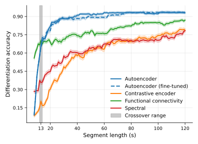
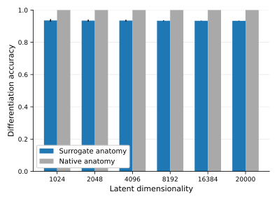
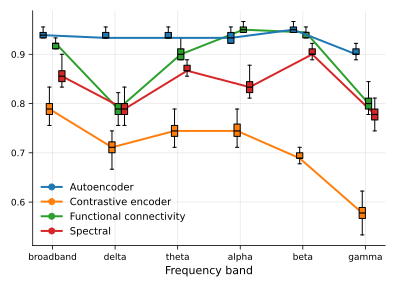
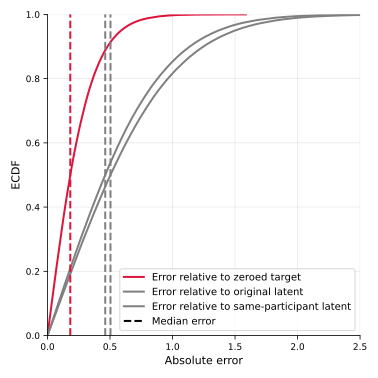
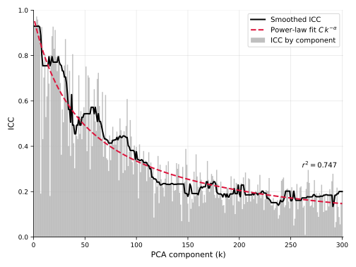
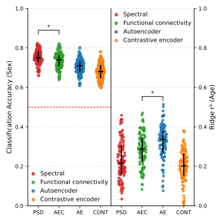

# Unsupervised Representation Learning Generates Differentiable Neurophysiological Profiles


Code for the paper ["Unsupervised Representation Learning Generates Differentiable Neurophysiological Profiles"](#TODO) (PREPRINT, SUBJECT TO CHANGES), (2026).

## Cite
If you use this code or model in your research, please cite the following paper:
```bibtex
@article{
 #TODO
}
```

## Contact
Since this work is a preprint, I welcome any feedback on the paper or the repository. If you have questions or require help running the code, please do not hesitate to contact me.

**Email me** at maxence (dot) lapatrie (at) mail (dot) mcgill (dot) ca.<br>
Or message me on **LinkedIn** [maxence-lapatrie](https://www.linkedin.com/in/maxence-lapatrie/).


## Repository Overview
This repository contains all the scripts for training and post hoc experimentations presented in the paper.
To run the experiments, you must first have the datasets accessible and formatted in BIDS format. The dataset objects `aefp/datasets` can also be modified to fit different datasets.
Before running the training scripts, please verify the data and save paths.

Configuration files are located in `conf`. [Weights & Biases](https://wandb.ai/site) is used to track the training progress and outputs. Set it up in the configuration files.

After configuring the model parameters in the configuration files, use `train/train.py` to train and save your first model. Use `train/fine_tune.py` to further fine-tune the model if needed.

Model code can be found under `aefp/architecture`. Code for the experiments can be found under `experiments/scripts/`.


## Installation
Install dependencies via pip:
```shell
git clone https://github.com/mLapatrie/aefp.git
cd aefp
pip install -e .
```
In case pip install -e . fails, the full list of requirements is also available under `requirements.txt`. We used Python 3.12.3.


## Preprocessing
Preprocess your data and extract the sensor data, imaging kernel, and interpolation kernel using [Brainstorm](https://neuroimage.usc.edu/brainstorm/Installation) as we did for the Cam-CAN dataset.

Additionally, [MNE-python](https://mne.tools/stable/index.html) can be used as we did for the OMEGA dataset. 

Preprocessing files can be found under `preprocessing`.

The `MEGDataset` object in `aefp/datasets/meg_dataset.py` expects a BIDS-like hierarchy where the final file is the preprocessed PyTorch tensor (.pt). The scripts under `preprocessing` help you generate this structure. We provide an example directory structure that the dataset object expects. The parcel definition depends on the participant's anatomy. We provide two default anatomy parcel definition files, one for Brainstorm and one for MNE, under `preprocessing/camcan/tess_cortex_pial_low.mat` and `preprocessing/omega/Schaefer2018_200_17networks_labels.txt` respectively.


### Directory Tree
```
data_path/
├── sub-01/
│   ├── interp_kernel.pt    <-- Interpolation kernel from Brainstorm or MNE preprocessing.
│   └── ses-01/
│       └── meg/               <-- data_modality
│           └── rest/          <-- data_type
│               ├── source_200.pt       <-- data_space + ".pt". 
│               │                           Needed for the MEGDataset object to load.
│               │                            Generated by the preprocessing scripts.
│               ├── sensor_data.pt      <-- Sensor data from Brainstorm or MNE preprocessing.
│               └── imaging_kernel.pt   <-- Session imaging kernel from Brainstorm or MNE.
├── sub-02/
│   ├── ses-01/
│   │   └── meg/
│   │       └── rest/
│   │           ├── source_200.pt
│   │           ├── sensor_data.pt
│   │           └── imaging_kernel.pt
│   └── ses-02/                <-- Multiple sessions allowed*
│       └── ...
└── ...
```


## Training
After setting up your preprocessed dataset or creating your own dataset object and configuring the proper configuration files, make sure the `train.py` file reads your dataset in `main()`. Intermediate outputs are saved on the WandB page. Weights will be saved under your save path.


## Experiments
This folder contains scripts for both profiling and interpretability experiments. The scripts below save their intermediate outputs under `experiments/.tmp` by default. Figures are saved under `experiments/.tmp` by default.

### Profiling
Scripts for profiling experiments can be found under `experiments/scripts/fingerprinting`.

`helpers/fingerprinting_helpers.py` and `fingerprint.py` contain the main profiling logic. The following scripts use them to test the profiling performance of the different approaches.

#### Effect of Segment Length on Differentiation Accuracy
`fingerprinting_lengths.py` tests the profiling accuracy as the length of neural data segments increases.



#### Robustness to Anatomy Alignment
`fingerprinting_compare.py` compares the profiling performance of multiple approaches at a fixed segment length. Also used for **Generalizability to Between-Session Profiling**.


#### Effect of Post Hoc Latent Dimensionality Reduction
`fingerprinting_dims.py` tests the change in profiling performance when subsampling the latent dimensionality of the profiles.



#### Frequency Band Contributions
`fingerprinting_bands.py` tests the effect of bandpass filtering the signal before creating the profiles on profiling performance.



#### Effect of Step Size on Model-Based Profiling
`fingerprinting_windows.py` tests the profiling accuracy as the step size of consecutive windows changes.


### Interpretability
Scripts for interpretability analyses can be found under `experiments/scripts/interpretability`.

`helpers/interpretability_helpers.py` contains various helpers for the scripts below. `extract_embeddings.py` extracts multiple embeddings from multiple subjects for downstream analyses, such as in `demographics_analysis.py`.

#### Autoencoder Output Validation
`reconstruction_interpretability.py` is used to generate comparisons between original and decoded images. It tests raw time series, functional connectivity (FC; using AEC), power spectral densities (PSD), peak alpha frequency (PAF) topographies, and time-frequency decompositions (TFD).


Similarly, `batch_recon.py` is used to generate those comparisons at scale. Used for supplementary figures 1 to 6.


#### Latent Space Stability Analysis
`pc_occlusion.py` tests the stability of the latent space to encoding cycles. 



Additionally, it calculates the ICC(3,1) for the first 95% of the principal components.




#### Feature Sensitivity Derivation from Changes in Output Features
Also contained within `pc_occlusion.py`, it derives feature sensitivities for FC and PSD features. Outputs FC plots and creates brain plots using `plot_schaefer.R`.


#### Demographics Associations
`demographics_analysis.py` fits a linear regression to the extracted profiles to predict a target demographic. Outputs the performance of each model over 100 bootstraps.



`plot_tsne.py` serves as both a visualization and an analysis tool. It creates a t-SNE plot of the latent space and tests its linearity. Outputs the following figure showing the relationship between Euclidean and geodesic distances.

