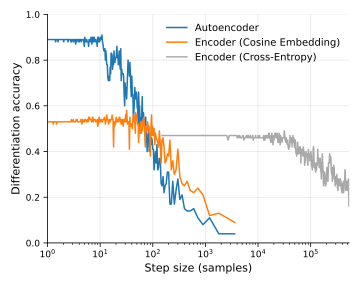

# Unsupervised Representation Learning Generates Differentiable Neurophysiological Profiles


Code for the paper ["Unsupervised Representation Learning Generates Differentiable Neurophysiological Profiles"]() (PREPRINT, SUBJECT TO CHANGES), (2026).

This repository contains all the scripts for training and post hoc experimentations presented in the paper.
To run the experiments, you must first have the datasets accessible and formatted in BIDS format. The dataset objects `aefp/datasets` can also be modified to fit different datasets.
Before running the training scripts, please verify the data and save paths.

Configuration files can be found under `conf`. [Weights & Biases](https://wandb.ai/site) is used to track the training progress and outputs. Set it up in the configuration files.

After configuring the model parameters in the configuration files, use `train/train.py` to train and save your first model. Use `train/fine_tune.py` to further fine-tuned the model if needed.

Model code can be found under `aefp/architecture`. Code for the experiments can be found under `experiments/scripts/`.


## Installation
Install dependencies via pip:
```shell
git clone https://github.com/mLapatrie/aefp.git
cd aefp
pip install -e .
```

## Preprocessing
Preprocess your data and extract the sensor data, imaging kernel, and interpolation kernel using (Brainstorm)[https://neuroimage.usc.edu/brainstorm/Installation] as we did for the Cam-CAN dataset.

Additionally, (MNE-python)[https://mne.tools/stable/index.html] can be used as we did for the OMEGA dataset. Preprocessing files can be found under `omega_preprocessing`.

The `MEGDataset` object under `aefp/datasets/meg_dataset.py` will try to find the 3 above mentioned items and a parcel definition file to save the parcellated, source reconstructed data. It then saves the preprocessed files for faster booting.


## Training
After setting up your preprocessed dataset or creating your own dataset object accordingly and configuring the proper configuration files, make sure the `train.py` file will read your file under `main()`. Intermediate output will be save on the WandB page. Weights will be saved under your save path.


## Experiments
This folder contains scripts for both profiling and interpretability experiments. The scripts below save their intermediate outputs under `experiments/.tmp` by default. Figures are saved under `experiments/.tmp` by default.

### Profiling
Scripts for profiling experiments can be found under `experiments/scripts/fingerprinting`.

`helpers/fingerprinting_helpers.py` and `fingerprint.py` contain the main profiling logic. They are used by the following scripts to test the profiling performance of the different approaches.

#### Frequency Band Contributions
`fingerprinting_bands.py` tests the effect of bandpassing the signal before creating the profiles on the profiling performance.


#### Robustness to Anatomy Alignment
`fingerprinting_compare.py` compares the profiling performance of multiple approaches at a fixed segment length.


#### Effect of Post Hoc Latent Dimensionality Reduction
`fingerprinting_dims.py` tests the change in profiling performance when subsampling the latent dimensionality of the profiles.


#### Effect of Segment Length on Differentiation Accuracy
`fingerprinting_lengths.py` tests the profiling accuracy as the length of neural data segments increases.


#### Effect of Step Size on Model-Based Profiling
`fingerprinting_windows.py` tests the profiling accuracy as the step size of consecutive windows changes.




### Interpretability
